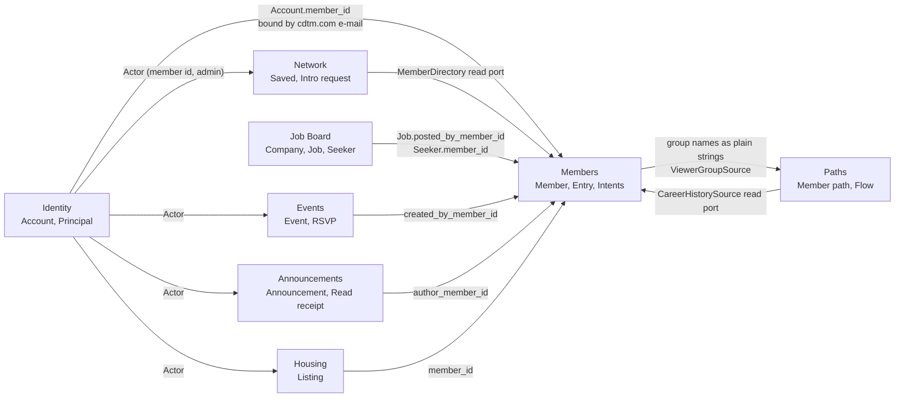

# Context map

The words each bounded context uses, and where its language stops. When two contexts use the
same word for different things, that is a boundary, and the mapping between them is written
down here rather than left to be assumed.

One FastAPI application holds eight contexts plus `core`, which owns the app factory,
settings, pagination, the error envelope and the shared Ask machinery, and has no domain
language of its own. The split follows the boards the product actually has
([ADR 0007](docs/adr/0007-bounded-contexts-follow-the-product-boards.md)); before it, six of
these eight lived together in one `backend/community/` package.

## Contexts

| Context | Glossary | Route prefix | In one line |
| --- | --- | --- | --- |
| Members | [`backend/members/CONTEXT.md`](backend/members/CONTEXT.md) | `/api/v1/members` | The directory of everyone who has ever been through CDTM |
| Network | [`backend/network/CONTEXT.md`](backend/network/CONTEXT.md) | `/api/v1/network` | The edge between two members: saved people and intro requests |
| Paths | [`backend/paths/CONTEXT.md`](backend/paths/CONTEXT.md) | `/api/v1/paths` | Where a class went afterwards, as a recomputed read model |
| Events | [`backend/events/CONTEXT.md`](backend/events/CONTEXT.md) | `/api/v1/events` | What is happening, and who said they are coming |
| Announcements | [`backend/announcements/CONTEXT.md`](backend/announcements/CONTEXT.md) | `/api/v1/announcements` | What the school tells everyone, and who has read it |
| Housing | [`backend/housing/CONTEXT.md`](backend/housing/CONTEXT.md) | `/api/v1/housing` | Rooms and flats members offer each other |
| Identity | [`backend/identity/CONTEXT.md`](backend/identity/CONTEXT.md) | `/api/v1/auth` | Who is calling, and which Member they are |
| Job Board | [`backend/jobboard/CONTEXT.md`](backend/jobboard/CONTEXT.md) | `/api/v1/{companies,jobs,seekers}` | Companies post Jobs; Seekers publish job-seeking profiles |

Every context has the same four layers: `api/`, `application/`, `domain/`, `infrastructure/`.
A context may import `backend.core`; it may not import another context's `application/`,
`domain/` or `infrastructure/`. The two exceptions are written down below, and both are
deliberate: the `api/` layer may compose two contexts into one response, and a read port may
reach another context's tables without touching its ORM.

## Relationships

### Identity to Members: one Account, one Member

An **Account** (Identity) binds to at most one **Member** (Members), and the binding key is
the `cdtm.com` e-mail address. The binding is a database column, `accounts.member_id`, unique
and `ON DELETE SET NULL`.

Both sides of the gap are normal states, not errors:

- A Member without an Account is someone with no CDTM Workspace mailbox. They are in the
  directory, their Entry is read-only scraped data, and nobody can edit it but an admin. This
  is roughly 175 people.
- An Account without a Member is a Workspace account that matched no roster row (a shared
  mailbox, or someone the loader has not seen yet). They can read the directory and write
  nothing member-owned, until an admin binds them. `GET /api/v1/auth/accounts?unbound=true`
  is the admin's list of exactly those.

`Member.is_claimed` is the Members context's word for "an Account exists for this Member". It
is computed at read time, not stored.

Direction of knowledge: Identity reads `members.email` and `members.slug` through a read port
(`backend/identity/infrastructure/member_directory.py`, raw `text()` queries), and nothing
else. No board sees an Account or a `Principal`; each receives an **Actor**
(`backend/core/actor.py`), which is a member id and an admin flag, produced by `ActorDep`,
`MemberActorDep` and `OptionalActorDep` in `backend/identity/api/deps.py`. Anything an Account
is beyond those two facts stops at the router.

### Network to Members: the edge, never a copy

**Saved member** and **Intro request** are edges between two member ids plus one piece of text
each. Network stores no name, no avatar and no headline. To render a card it asks the
`MemberDirectory` read port
(`backend/network/infrastructure/member_directory.py`), which is raw SQL against
`members` and imports nothing from `backend.members`. A saved member whose row has since been
deleted comes back as an `Unknown member` placeholder rather than a missing entry, because the
note the saver wrote is still theirs.

### Paths to Members: a read model, not a second directory

**Member path** is derived data: one row per member, recomputed from that member's positions
and educations. Paths never imports `backend.members`. It reads the six member tables it needs
through metadata-free `sqlalchemy.table()` handles in
`backend/paths/infrastructure/_member_tables.py`, which exist so Core queries can still be
composed while Alembic never sees a second mapping of the same tables, and it loads career
history through the `CareerHistorySource` port.

### Members to Paths: borrowed vocabulary, in one direction

The Members context has no word of its own for a career group. The Ask over the directory
still needs to accept "who went into Venture Capital", so the Paths group names
(`STUDY_GROUP_NAMES`, `CAREER_GROUP_NAMES`) are injected into the members translators as
plain strings, and a name that is not in that list is dropped from the filters rather than
guessed at. The same applies to the asker's own current group, which arrives through the
`ViewerGroupSource` port so that "others who ended up where I did" can resolve.

Composition happens in the API layer and nowhere else: `backend/members/api/ask.py` runs the
members Ask, asks the members service for the full set of matching ids, and asks the paths
service for the flow drawn over exactly those people. `AskAnswer` (domain) has no flow;
`AskAnswerPublic` (api) does. Nothing under `application/` or `domain/` may do the same.

### Job Board to Members: a Seeker may be a Member

A **Seeker** (Job Board) and a **Member** (Members) are different things that are often the
same human. A Seeker is a job-seeking profile that exists to be read by a Company; a Member is
a person in the roster. `seekers.member_id` records the overlap when it exists, and is nullable
because it need not.

`jobs.posted_by_member_id` records which Member posted a Job. Both ids are server-assigned
from the caller's Actor and are not part of any request body, so a posting cannot be attributed
to somebody else. They are nullable and `ON DELETE SET NULL`, because a posting outlives the
poster's directory row.

Nothing flows the other way. Members has no word for a Job and does not know the Job Board
exists.

### Events, Announcements and Housing to Members: an id and a lookup

A row that has an author carries that author's member id and nothing else:
`events.created_by_member_id`, `announcements.author_member_id`, `housing_listings.member_id`.
None of these contexts stores a name or an avatar, and none of them joins to `members`. The UI
resolves a page's worth of ids in one call to `GET /api/v1/members/lookup?ids=`, the same way
the job board resolves a page's worth of company names in one call to
`GET /api/v1/members/at-company?company=`.

### Words that mean different things on each side

| Word | Where | Meaning |
| --- | --- | --- |
| **Listing** | Housing | A room or flat on offer, or somebody looking for one |
| **Listing** | Job Board | Avoided. A Job is a Job |
| **Company** | Members | A denormalised LinkedIn snapshot on a Member (`company_info`) |
| **Company** | Job Board | A curated record with a slug, a careers page and a CDTM-startup flag |
| **Group** | Paths | A bucket in the read model: a study group, a career group, an intent |
| **Group** | Members | Not a word this context has. It accepts the Paths names as strings |
| **Matching** | Members | The loader deciding a roster row and a Workspace person are the same human |
| **Binding** | Identity | An Account attached to a Member by exact e-mail |
| **Profile** | Members | Avoided for the person; the person is a Member and what they maintain is an Entry |
| **Profile** | Job Board | A Seeker is the profile |
| **View** | Housing | One non-owner opening a listing, counted |
| **View** | Everywhere else | Not counted anywhere else |

`Company` is the sharpest one. A Member's employer string is whatever LinkedIn had; a Job
Board `Company` is a row someone at CDTM curated. They are not the same table and should not
become one.

### Words nobody may use

- "User". Every context avoids it. Members says Member, Identity says Account. The word hides
  exactly the distinction the identity model is about.
- "Alumni" for the whole population. It excludes current students, Center Assistants and
  faculty, all of whom are Members.
- "Login" as a noun for the person. That is an Account.
- "Community" as the name of a context. It was the name of one package that held six boards;
  now it is only the name of the product.

## See also

- [`docs/architecture.md`](docs/architecture.md): how these contexts are wired at runtime
- [`docs/adr/0007-bounded-contexts-follow-the-product-boards.md`](docs/adr/0007-bounded-contexts-follow-the-product-boards.md): why the split is by board
- [`docs/adr/0001-google-workspace-account-is-the-identity.md`](docs/adr/0001-google-workspace-account-is-the-identity.md): why the binding is by e-mail
- [`docs/adr/0002-one-backend-for-community-and-job-board.md`](docs/adr/0002-one-backend-for-community-and-job-board.md): why one backend holds both products
- [`docs/adr/0006-natural-language-ask-translates-to-filters.md`](docs/adr/0006-natural-language-ask-translates-to-filters.md): why Ask produces filters, not SQL
