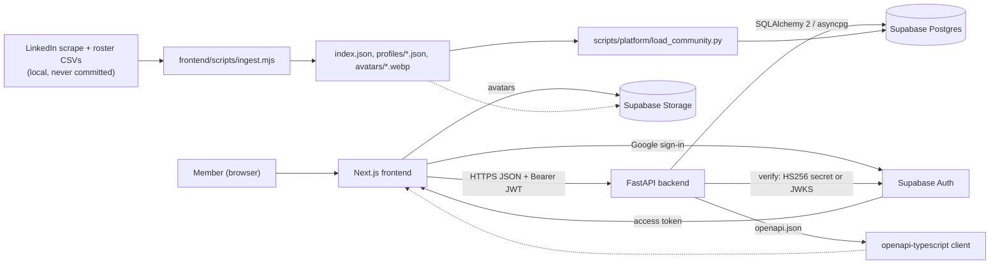
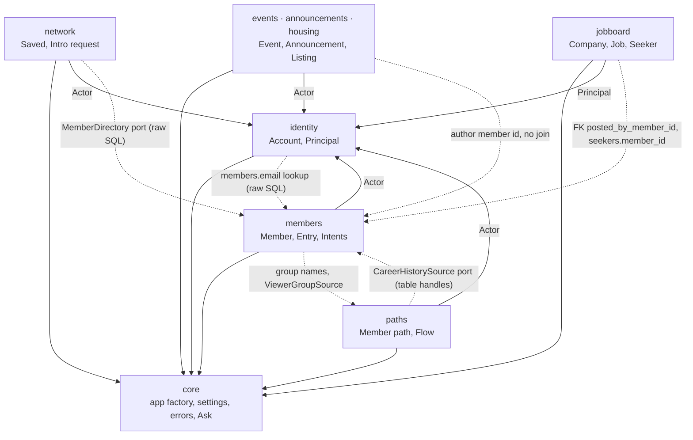
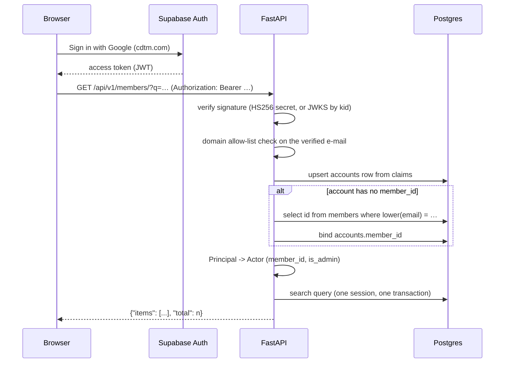
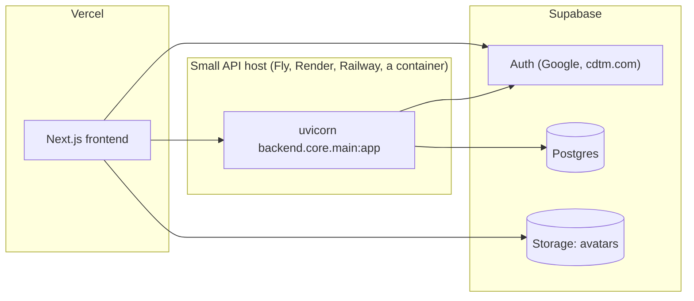

# CDTM Community technical architecture

The Community Tool is meant to be the central place to connect the CDTM community more
effectively. It should help people discover each other quickly, start collaborations, and turn
shared interests into action, whether that is founding, mentoring, hiring, speaking, or
hobbies. The goal is clear value, low friction, and a reason to come back.

Everything below serves that. The directory has to be fast enough to browse idly, the sign-in
has to be one click for anyone with a CDTM mailbox, and the things a Member writes about
themselves have to survive the next data load.

## 1. System overview



The browser never reaches the database. It holds a Supabase access token and talks to one
FastAPI origin. Supabase's PostgREST, Realtime and Edge Functions are not used at all
(ADR 0003); Supabase is the identity provider, the object store and the Postgres host.

The data pipeline is offline and one-way. LinkedIn scrapes and roster CSVs never touch the
server. `ingest.mjs` runs on a laptop, produces files, and a Python loader moves those files
into Postgres (ADR 0004). Nothing in the request path reads them.

The frontend's API client is generated, not written. `scripts/platform/export_openapi.py`
writes `frontend/openapi/openapi.json` from the live app, and `npm run generate:api` turns it
into `frontend/src/api/schema.d.ts` for `openapi-fetch`. The contract has one source: the
FastAPI routers.

## 2. Stack choices

- FastAPI (Python 3.11+). The API contract is pydantic models that are also the domain models,
  so the OpenAPI document and the code cannot drift. Dependency injection is what makes
  `PrincipalDep` a one-word authorization statement in a route signature.
- SQLAlchemy 2 async and asyncpg. The queries this product needs are joins and aggregates
  (see [`database-design.md`](database-design.md) sections 4 and 8). Alembic owns the schema
  and a test proves the migrations reproduce the ORM (ADR 0003).
- Supabase. Managed Postgres with poolers and backups, Google Workspace sign-in without
  running an IdP, and a public object store for avatars. The parts we do not use are as
  deliberate as the parts we do.
- Next.js 16 and React 19. The predecessor was already a Next app. It is a normal Next server
  build rather than the static `output: "export"` of the directory-only era, because the
  session now lives in the browser and every read goes to the API; avatars and the ingest
  output stay under `public/` as plain files, already sized by `ingest.mjs`, so image
  optimisation is off.
- Node for ingest. `sharp` for avatar resizing and years of accumulated name-matching
  exceptions live there already (ADR 0004).
- uv and poethepoet. One lockfile, one virtualenv, and task names short enough to be typed
  from memory (`uv run poe api`).

## 3. Bounded contexts

`backend/` holds `core`, eight bounded contexts and `media`. A context is one board of the
product or one cross-cutting concern, and nothing larger (ADR 0007). Each context has the same
four layers:

```text
backend/<context>/
  api/               FastAPI routers, request/response schemas, DI wiring
  application/       services (use cases, authorization), commands, ports (Protocols)
  domain/            pydantic aggregates and StrEnums; no framework imports
  infrastructure/    orm_models.py and *_repository.py (SQLAlchemy)
  CONTEXT.md         the words this context uses, and the ones it refuses
```

| Context | Route prefix | Owns | Depends on |
| --- | --- | --- | --- |
| `core` | `/health`, `/` | `create_app()`, settings, exception hierarchy, error envelope, pagination, the shared Ask machinery and `ask_quota` | nothing |
| `identity` | `/api/v1/auth` | `accounts`, JWT verification, `Principal`, and the dependencies that turn one into an `Actor` | `core` |
| `members` | `/api/v1/members` | members, classes, entries, intents, CA details, positions, educations, and the Ask over the directory | `core`, `identity` (dependencies only) |
| `network` | `/api/v1/network` | saved members, intro requests | `core`, `identity` |
| `paths` | `/api/v1/paths` | `member_paths`, the classifier, the flow | `core`, `identity` |
| `events` | `/api/v1/events` | events, RSVPs | `core`, `identity` |
| `announcements` | `/api/v1/announcements` | announcements, read receipts | `core`, `identity` |
| `housing` | `/api/v1/housing` | listings and the Ask over them | `core`, `identity` |
| `jobboard` | `/api/v1/{companies,jobs,seekers}` | companies, jobs, seekers | `core`, `identity` |
| `media` | `/api/v1/media` | no tables; upload, read and delete against a blob store | `core`, `identity` |

Until 2026-08-22 the six contexts in the middle were one package called `community`. It had
grown to eight aggregates and a `CONTEXT.md` trying to define "Listing" next to "Intro
request", which is why ADR 0007 split it along the boards the product actually has. Nothing
called `backend/community/` or `/api/v1/community/...` exists any more.



The solid arrows are ordinary imports. The dashed ones are the only couplings between
contexts, and every one of them is a read port or a foreign key, never an ORM import:

- `identity` reads `members` by e-mail. `SqlMemberDirectory` issues two `text()` queries
  (`by email`, `by slug`) rather than importing the members ORM, so the dependency is one
  column name wide and cannot grow by accident. `network` reads member cards the same way
  through its own `infrastructure/member_directory.py`.
- `paths` recomputes its read model from positions and educations without importing
  `backend.members` at all. `backend/paths/infrastructure/_member_tables.py` holds
  `sqlalchemy.table()` handles that carry no metadata, so Core queries still compose while
  Alembic never sees a second mapping of the same tables, and career history arrives through
  the `CareerHistorySource` port.
- `members` borrows the Paths vocabulary in one direction only. The study and career group
  names are injected into its Ask translators as plain strings and an unknown name is dropped,
  because this context has no word of its own for a career group.
- No board imports `Principal`. Services take an `Actor` (member id, admin flag) from
  `backend/core/actor.py`, and `backend/identity/api/deps.py` is the single place that turns
  one into the other, so a change to how people log in stops at the router layer.
- `jobboard` references `members.id` from `jobs.posted_by_member_id` and `seekers.member_id`.
  Both are nullable, both `ON DELETE SET NULL`: the job board keeps working for a poster who is
  not in the directory. Both are set from the caller's Actor and are not request fields, so a
  posting cannot be attributed to somebody else.

Cross-context composition is allowed in an `api/` layer and nowhere else. The one case is
`backend/members/api/ask.py`: it runs the members Ask, asks the members service for the full
set of matching ids, and asks the paths service for the flow drawn over exactly those people.
`AskAnswer` (domain) has no flow; `AskAnswerPublic` (api) does.

Inside a context, `api/` is split by feature rather than by aggregate, because that is how the
UI is split: `members/api/` is `members.py` (directory and one profile), `me.py` (everything
the signed-in Member maintains) and `ask.py`, wired together by `router.py`, which includes
`ask` and `me` before `members` so that `/members/ask` never resolves as `/members/{slug}`.

## 4. Request flow and authentication



Step by step, and where each step lives:

1. Bearer extraction. `identity/api/deps.py::_bearer` accepts exactly
   `Authorization: Bearer <token>`. A malformed header is a 401, not a silent anonymous
   request.
2. Signature verification. `SupabaseJwtVerifier` reads the token header and branches on
   `alg`: `HS*` verifies against `SUPABASE_JWT_SECRET`, anything else fetches the signing key
   from `{SUPABASE_URL}/auth/v1/.well-known/jwks.json` through a cached `PyJWKClient`. Both
   paths check `aud` (`authenticated` by default) and expiry. Supabase projects exist in both
   configurations and which one you get is not our choice, so both are supported and neither is
   assumed.
3. Domain allow-list. `AuthService.authenticate` lower-cases the e-mail and checks its
   domain against `AUTH_ALLOWED_EMAIL_DOMAINS` (default `cdtm.com`). A valid token from
   another domain gets a 403 rather than a 401: the credential is fine, the person is not in
   this community, and retrying with a fresh token will not help.
4. Account upsert. First sight of a `sub` inserts an `accounts` row from the claims;
   later sights refresh name, avatar and `last_sign_in_at`. There is no registration step.
5. E-mail binding. An Account with no `member_id` triggers one lookup against
   `members.email`. If it hits, the binding is written once and never looked up again
   (ADR 0001).
6. Principal to Actor. Routers depend on one alias, in increasing strictness:

   | Dependency | Yields | Requires |
   | --- | --- | --- |
   | `OptionalPrincipalDep` | `Principal \| None` | nothing; `None` when no header is present |
   | `PrincipalDep` | `Principal` | a valid token from an allowed domain |
   | `MemberPrincipalDep` | `Principal` | that, plus an Account bound to a Member |
   | `AdminPrincipalDep` | `Principal` | that, plus `is_admin` |
   | `OptionalActorDep` | `Actor \| None` | nothing |
   | `ActorDep` | `Actor` | a valid token from an allowed domain |
   | `MemberActorDep` | `Actor` | that, plus an Account bound to a Member |

   Reads take `PrincipalDep` or `OptionalActorDep` (sign-in is the gate for the directory as a
   whole). Writes to member-owned data take `MemberActorDep`, because there is no row to write
   without a `member_id`. The `Actor` aliases exist so that a board never names a `Principal`:
   they are the boundary described in section 3. Announcements check `is_admin` at the service
   layer.

7. Per-request session. `infrastructure/db.py::get_db` yields one `AsyncSession` per
   request. Repositories never commit; the application service that owns the use case does.

Fine-grained rules stay in the `application/` services, never in routers: only the target of an
intro request may accept it, only the requester may withdraw it, only the organiser or an
admin may edit an event, and only the owner or an admin may edit a housing listing.

The same layer decides what a caller is told, not just what they may do:

- `MemberService._redact` strips `email` from anyone who is not looking at themselves, hides an
  Entry whose `visibility` is `hidden`, and nulls the `review` block (how confidently the
  loader bound this person to a mailbox) for anyone who is not an admin. `roster_person_id`
  is not in any response model at all.
- `HousingService._for_viewer` nulls `view_count` for everyone but the owner and an admin, and
  `HousingService.view` increments it only when the person opening the listing is neither. An
  owner refreshing their own page is not an audience, and an admin opening a listing is
  moderating it.

## 5. Errors

Every error leaves the API in one shape:

```json
{ "error": { "code": "not_found", "message": "member 'ada-lovelace' not found", "ref": "9f1c…" } }
```

`ref` is a fresh hex UUID, returned in the body and in the `X-Error-ID` response header,
which CORS exposes to the browser. The same `ref` is written to the log line, so a screenshot
from a Member is enough to find the request.

`backend/core/exceptions.py` is the only vocabulary application code raises:

| Exception | HTTP | `code` |
| --- | --- | --- |
| `ValidationError` | 422 | `validation_error` |
| `UnauthorizedError` | 401 | `unauthorized` |
| `ForbiddenError` | 403 | `forbidden` |
| `NotFoundError` | 404 | `not_found` |
| `ConflictError` | 409 | `conflict` |
| `RepositoryError` | 503 | `storage_unavailable` |
| `AppError` | 500 | `internal_error` |

What makes it predictable:

- 5xx messages are never the exception's message. `AppError` handlers substitute "Something
  went wrong" at or above 500, and log with `logger.exception`. Below 500 the message was
  written to be read by a person and is passed through.
- Driver errors never escape infrastructure. `run_db` maps SQLSTATE `23505` to
  `ConflictError`, other `23xxx` to `ValidationError`, and operational failures to
  `RepositoryError`.
- `HTTPException` gets a generic public message from a fixed table, so a third-party library
  cannot leak internals through a status code.

`RequestValidationError` is the one case that carries `details`, holding pydantic's own error
list, because a form needs to know which field was wrong.

## 6. Security boundaries

- Transport headers are set on every response by one middleware in `core/app.py`: HSTS
  (one year, including subdomains), `X-Content-Type-Options: nosniff`,
  `X-Frame-Options: DENY`, `Referrer-Policy: strict-origin-when-cross-origin`, and
  `Content-Security-Policy: default-src 'none'; frame-ancestors 'none'`. The CSP is right for
  a JSON API: the API serves no HTML that should ever load a subresource.
- CORS allows only the origins in `APP_CORS_ORIGINS` (default `http://localhost:3000`), with
  credentials, the six methods the API actually uses, and exactly two request headers
  (`Authorization`, `Content-Type`). `X-Error-ID` is the only exposed response header.
- Docs are off in production. `/docs`, `/redoc` and `/openapi.json` are only mounted when
  `APP_ENVIRONMENT != production`; the committed `frontend/openapi/openapi.json` is how the
  client is generated instead.
- Settings fail at boot, not on first use. `create_app()` resolves all four settings objects
  before the first request, so a missing `DATABASE_URL` is a startup crash rather than a 500 an
  hour later.
- The empty string is not a value. `env_ignore_empty=True` means a template line such as
  `SUPABASE_JWT_SECRET=` reads as unset. Without it the empty string would validate and the
  API would accept tokens signed with nothing.
- The service-role key is server-side only and, after ADR 0003, is needed for Storage alone.
  The database credential is `DATABASE_URL` and never leaves the API host.
- PII stays out of git. `data/` holds the roster CSVs, the Workspace export and the raw
  scrape, and nothing in it but `data/README.md` is committed. `frontend/data/`, `*.xlsx`,
  `05_2026/` and `05_2026.zip` are legacy locations kept in `.gitignore`.

## 7. OpenAPI to frontend client

```bash
uv run poe openapi            # backend -> frontend/openapi/openapi.json
cd frontend && npm run generate:api   # openapi.json -> src/api/schema.d.ts
npm run check:api             # fails if the committed schema is stale
```

`export_openapi.py` forces `APP_ENVIRONMENT=development` so the schema never depends on a
production flag, and writes with `indent=2, sort_keys=True` so a one-field change is a
one-line diff. `frontend/openapi/openapi.json` and the generated `schema.d.ts` are committed;
neither is hand-edited.

Response shapes are stable by construction: `XPublic` subclasses the domain model, and a list
endpoint returns `{items, total}` from `PageResult[T]`. Every list takes `skip` and `limit`
(`limit` capped at 100 by `core/api/pagination.py`). The two batched reads that exist to keep a
page down to one request, `GET /api/v1/members/lookup?ids=` and
`GET /api/v1/members/at-company?company=`, cap their input at 50 and drop what matches
nothing rather than erroring.

## 8. Deployment sketch



Three moving parts, and the only stateful one is Supabase.

- Supabase holds Postgres, Auth and Storage. Configure the Google provider, restrict it to the
  `cdtm.com` Workspace, and set the redirect URLs. Migrations are applied with Alembic over a
  direct connection (`DATABASE_MIGRATOR_URL`, port 5432), never through the pooler.
- The API is one long-lived uvicorn process. Because it is long-lived it should use the direct
  connection too; the transaction pooler (6543) is there for serverless or many-replica
  deployments, and `get_async_engine` disables asyncpg's statement cache when it detects one.
  Set `APP_ENVIRONMENT=production` (docs off), `APP_CORS_ORIGINS` to the frontend origin, and
  the Supabase JWT secret or URL.
- The frontend deploys to Vercel with `NEXT_PUBLIC_API_URL` and the Supabase anon key.

Data loading is an operator task, not part of a deploy: run `ingest.mjs` locally, then
`uv run poe load-community` against the target database.

## 9. Media and storage

Job logos and covers and housing photos are uploaded through the API, not straight into
Supabase Storage from the browser.

The buckets are private. A public bucket would mean handing the browser a URL that works
forever for anyone who ever sees it, and a write path that needs a key the browser must not
hold. Instead the API is the only reader and writer, and the service-role key stays on the
server. Three buckets, fixed: `job-images`, `housing-photos`, `avatars`.

The URL in the database points at the API. `POST /api/v1/media/{kind}` answers with
`{APP_PUBLIC_BASE_URL}/api/v1/media/{bucket}/{key}`, and that string is what goes into
`jobs.image_url` or `housing_listings.photo_urls`. Rows written today keep working when the
storage backend changes, because nothing outside `media/infrastructure/` ever learns where
the bytes actually live.

Reads are unauthenticated, and that is the design. These URLs sit in ``
tags, which cannot send an `Authorization` header. The access control is the key: a random
UUID, only ever handed to the uploader and to whoever can already read the row it was stored
on. Uploads require a `Principal`; deletes require an admin, because nothing records who
uploaded a blob and there is no owner to compare a caller against.

Two adapters sit behind one port. `BlobStorage` is four methods: `put`, `get`, `signed_url`,
`delete`. `LocalDiskStorage` writes `<STORAGE_LOCAL_DIR>/<bucket>/<key>` and cannot sign, so
the API streams the bytes with a one-year immutable `Cache-Control`. `SupabaseStorage` is
plain httpx against the Storage REST API, no SDK, and can sign, so the API answers a read
with a 307 to a ten-minute signed URL and only streams when signing fails.
`STORAGE_BACKEND` picks one.

The bytes decide the type, not the declared header. The multipart `Content-Type` is caller-
controlled, so uploads are sniffed for the JPEG, PNG and WebP magic numbers and anything else
is a 422. The stored key is `<uuid4>.<ext>` derived from the sniffed type, which is also how
a read recovers the content type without a sidecar file. Over `STORAGE_MAX_UPLOAD_BYTES`
(5 MiB) is a 413, decided after reading one byte past the limit rather than the whole body.

`media` is a small bounded context of its own (`backend/media/api/router.py` and
`backend/media/infrastructure/`): no aggregate, no tables, but the same dependency rule as
every board, so `core` keeps importing nothing. Its settings
(`StorageSettings`) live in `core/settings/storage.py` like every other settings class.

## 10. What is not in scope

The gaps are as deliberate as the boundaries above.

- No end-user notifications: no e-mail, push or Slack. An intro request changes a row; the
  target sees it next time they open the app. Sending mail on someone's behalf is a product
  decision nobody has taken.
- No background jobs, no queue, no worker. Every write completes inside its request. The one
  expensive computation, career paths, runs in the loader.
- No realtime: no websockets, no SSE, no Supabase Realtime. The directory is not a chat.
- No file uploads beyond images. Section 9 covers job and housing images; resumes and any
  other document are still URLs the client supplies, and nothing transcodes, resizes or
  virus-scans what is uploaded.
- No RLS-based authorization. The API connects as an owning role and enforces access in
  `application/` services (ADR 0003).
- No public, unauthenticated surface beyond `/`, `/health` and reading an uploaded image by
  its unguessable key. Even the job board, which used to be open, now requires a signed-in
  Principal.
- No search engine. Directory search is `ILIKE` over a denormalised `search_text` column with
  a trigram index. That is enough for roughly 1,400 rows and stops being enough at a scale
  this community will not reach.
- No LLM near the data. The Ask box translates a plain-words question into a filter object
  and the ordinary repositories run it; the model never sees rows and never writes SQL
  (ADR 0006, [`ask.md`](ask.md)).
- No admin UI. Admins are bootstrapped from `AUTH_ADMIN_EMAILS` and act through the API.

## See also

- [`database-design.md`](database-design.md): every table, constraint and index, plus the
  Supabase connection profiles and the migration workflow.
- [`adr/`](adr/README.md): the decisions this document is downstream of.
- [`../CONTEXT-MAP.md`](../CONTEXT-MAP.md): the domain vocabulary of each context.
