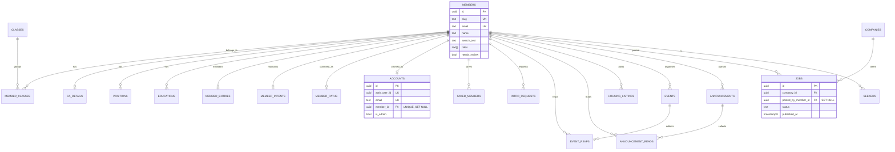
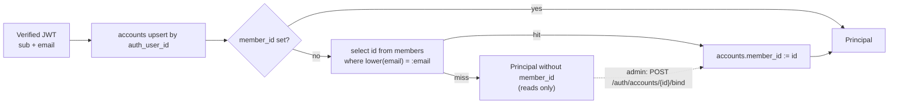

# Database design and execution model

This document describes the schema behind the CDTM Community platform and the rules that keep
it working against Supabase Postgres. It is written for someone who has to add a column, debug
a slow query, or take a first look at a database they did not build.

It covers:

- which tables exist, who owns them, and how they relate;
- why enumerations are `TEXT` plus `CHECK` and not Postgres `ENUM` types;
- how directory search is built (`search_text`, `pg_trgm`);
- how `member_paths` is derived and by what;
- how `accounts` binds to `members`;
- Supabase connection profiles, pooling, and the statement timeout;
- the migration workflow and the test that keeps migrations and ORM in step.

The schema's source of truth is the Alembic history under
`infrastructure/alembic/versions/`. The SQLAlchemy ORM models mirror it, and
`tests/integration/test_migrations.py` proves the mirror is exact. Neither replaces the other.

## 1. Ownership and access

One database, one writer. There is no worker, no queue and no second service.

| Component | Responsibility | Database access |
| --- | --- | --- |
| FastAPI backend | Every read and write in the request path | Async SQLAlchemy over asyncpg, `DATABASE_URL` |
| Alembic | DDL | Sync SQLAlchemy over psycopg, `DATABASE_MIGRATOR_URL` (direct connection) |
| `load_community.py` | Bulk upsert of roster, scrape and paths | Async SQLAlchemy, same session factory as the app |
| `seed_dev_data.py` | Development fixtures | Same |
| Browser | UI | Never connects to Postgres |
| Supabase Auth | Issues JWTs | Owns the `auth` schema; the app never queries it |
| Supabase Storage | Avatar objects | Server-side only |

The API connects as an owning role and enforces access rules in `application/` services. Row
Level Security is not part of the authorization model (ADR 0003). Rules such as "only
the target of an intro request may accept it" or "hide the e-mail unless you are looking at
yourself" live in the services under each context's `application/`, where they are
unit-testable and where they can carry a helpful message.

## 2. Contexts and their tables

Twenty-one application tables, nine owners. (Alembic's own `alembic_version` makes
twenty-two relations in the database; it is not part of the model and the migration test
excludes it.)

| Context | Tables |
| --- | --- |
| `members` | `classes`, `members`, `member_classes`, `ca_details`, `positions`, `educations`, `member_entries`, `member_intents` |
| `network` | `saved_members`, `intro_requests` |
| `paths` | `member_paths` |
| `events` | `events`, `event_rsvps` |
| `announcements` | `announcements`, `announcement_reads` |
| `housing` | `housing_listings` |
| `identity` | `accounts` |
| `jobboard` | `companies`, `jobs`, `seekers` |
| `core` | `ask_quota` |

The six boards were one `community` context until ADR 0007 split them. The tables did not
move and the migration did not change because of the split; only the module that declares
each one did.

Each context's ORM lives in `backend/<context>/infrastructure/orm_models.py`, except `core`,
whose one table is declared in `backend/core/llm/orm_models.py` next to the meter that writes
it. `infrastructure/models.py` imports all nine so `Base.metadata` is complete; that is the
only module Alembic's `env.py` and the migration test import. A new context with tables must
be added there, or its tables will silently vanish from autogenerate.

Foreign keys that cross a context are written as string references (`ForeignKey("members.id")`)
rather than as a reference to the mapped class. A string is resolved against `Base.metadata` at
mapper configuration time, so `housing` can point at `members.id` without importing
`MemberRow`, and the ORM split costs the schema nothing. Every such edge is listed in
[`../CONTEXT-MAP.md`](../CONTEXT-MAP.md).

Across `members`, `paths` and the boards the tables fall into groups with different write
authority (ADR 0005), and that distinction matters more than the context boundary when you are
changing the loader:

- Loader-owned, rewritten by `load_community.py`: `classes`, `members`, `member_classes`,
  `ca_details`, `positions`, `educations`.
- Member-owned, written only through `/api/v1/members/me/...`: `member_entries`,
  `member_intents`. The loader never touches these.
- Derived, recomputed and never edited by hand: `member_paths` (section 9).
- Operational, written by the platform rather than by anybody's use case: `ask_quota`
  (section 6.7), and `housing_listings.view_count`.
- Everything else is written through the API by whoever is signed in.

## 3. Relational overview



`members` is the hub. Almost every foreign key in the schema points at it, and the ones that
cascade (`member_classes`, `ca_details`, `positions`, `educations`, `member_entries`,
`member_intents`, `member_paths`, `saved_members`, `intro_requests`, `event_rsvps`,
`announcement_reads`, `housing_listings`) mean deleting a Member removes everything derived
from them and nothing else. The edges that must survive a directory reload
(`accounts.member_id`, `jobs.posted_by_member_id`, `seekers.member_id`,
`events.created_by_member_id`, `announcements.author_member_id`) are `ON DELETE SET NULL`,
because a login, a job posting and an event that happened all outlive one roster row.

`ask_quota` is the only table with no edge to `members` at all. Its key is a caller, not a
person, and a meter has to keep working while the thing it is metering is being deleted.

## 4. Table catalog: members, loader-owned

### 4.1 `classes`

A CDTM cohort.

| Column | Type | Notes |
| --- | --- | --- |
| `id` | `integer` PK | The **roster's** id, not generated. `autoincrement=False`. |
| `label` | `text` NOT NULL UNIQUE | For example `Spring 2021`. |
| `season` | `text` | `spring` / `fall`, nullable in old roster rows. |
| `year` | `integer` NOT NULL | |
| `location` | `integer` | Roster location code. |

The primary key comes from the roster so that re-running the loader is a pure upsert and
`member_classes` rows survive it. If the id were generated, every load would either duplicate
classes or need a second key to match on.

### 4.2 `members`

The roster identity plus the LinkedIn snapshot. This is the widest table in the schema and the
one every read touches.

| Column | Type | Notes |
| --- | --- | --- |
| `id` | `uuid` PK | `gen_random_uuid()` |
| `slug` | `text` NOT NULL UNIQUE | Ingest's stable id, also the public URL segment. |
| `roster_person_id` | `integer` UNIQUE | Roster row id where one is known. |
| `name`, `first_name`, `last_name` | `text` | `name` NOT NULL and `CHECK (length(trim(name)) > 0)`. |
| `roster_name` | `text` | The roster's spelling when it differs from LinkedIn's. |
| `email` | `text` UNIQUE | Lowercase Workspace address. **The binding key for `accounts`.** |
| `headline`, `summary`, `location`, `linkedin_url` | `text` | From the scrape. |
| `avatar_sm_url`, `avatar_lg_url`, `avatar_blur` | `text` | 160 px, 400 px, and a blur placeholder. |
| `class_label`, `major` | `text` | Denormalised for the facet filters. |
| `roles` | `text[]` NOT NULL, default `{}` | `student` / `ca` / `faculty`; roles accumulate. |
| `is_ca`, `ca_alumni` | `boolean` | `ca_alumni` is nullable: unknown is not false. |
| `matched`, `match_method`, `needs_review` | `boolean`, `text`, `boolean` | Ingest's join verdict, carried through as data. Admin-only on the way out (see below). |
| `current_company`, `current_title` | `text` | From the scrape; an Entry may override them for display. |
| `skills`, `languages` | `text[]` NOT NULL, default `{}` | |
| `company_info` | `jsonb` | The LinkedIn company block for the current employer. |
| `search_text` | `text` NOT NULL, default `''` | Denormalised search haystack (section 8). |
| `linkedin_synced_at` | `timestamptz` | `generatedAt` from the ingest index. |
| `created_at`, `updated_at` | `timestamptz` NOT NULL, default `now()` | |

Indexes: `ix_members_name`, `ix_members_class_label`, `ix_members_major`, and
`ix_members_search_text_trgm` (GIN, `gin_trgm_ops`).

Four of these columns are roster-matching bookkeeping and none of them is public. They say how
confidently the loader decided that a roster row, a LinkedIn profile and a Workspace mailbox
are the same human, which is an admin's problem and nobody else's. `roster_person_id` is an id
in a source system and never leaves the backend at all; `matched`, `match_method` and
`needs_review` reach the API only as a `review` block on a member profile, which
`MemberService._redact` sets to `null` for every caller who is not an admin. The columns
themselves are unchanged. `needs_review` survives as a query parameter on the directory search,
so the admin bind page can list exactly the rows that need attention, and it is admin-only too:
`MemberService.search` refuses it with a 403 rather than answering, because which members the
loader was unsure about is the same fact as the `review` block.

`company_info` is `jsonb` rather than a `companies` foreign key on purpose. It is a LinkedIn
snapshot of an employer, denormalised and read whole; the job board's `companies` table is a
CDTM-curated record with a slug and a careers page. Conflating them would mean every LinkedIn
employer string becoming a curated company row.

### 4.3 `member_classes`

| Column | Type | Notes |
| --- | --- | --- |
| `member_id` | `uuid` FK -> `members.id` `ON DELETE CASCADE` | |
| `class_id` | `integer` FK -> `classes.id` `ON DELETE CASCADE` | |

Composite primary key `(member_id, class_id)`, plus `ix_member_classes_class_id` for the
reverse lookup ("everyone in this class"), which the composite PK cannot serve.

The domain says a *student* Member belongs to exactly one Class. The table is many-to-many
anyway, because Center Assistants are associated with several, and because a person can be a
student of one class and a CA during another.

### 4.4 `ca_details`

Center Assistant details, keyed one-to-one on `member_id` (which is itself the primary key).

| Column | Type | Notes |
| --- | --- | --- |
| `member_id` | `uuid` PK, FK -> `members.id` `ON DELETE CASCADE` | |
| `alumni` | `boolean` NOT NULL default `false` | Former CA. |
| `about` | `text` | From the CDTM CMS. |
| `responsibilities`, `research_fields` | `text[]` NOT NULL default `{}` | |
| `email` | `text` | The CMS-published address; the loader promotes it to `members.email` when it ends in `@cdtm.com`. |

### 4.5 `positions` and `educations`

LinkedIn history, deleted and rewritten on every load.

`positions`: `id` uuid PK, `member_id` FK cascade, `title`, `company`, `company_url`,
`description`, `location`, `start_date`, `end_date` (`date`), `date_range` (the raw
"Jan 2021 - Present" string), `is_current` boolean, `sort_order` integer, `source` text default
`'linkedin'`. Index `ix_positions_member_id`.

`educations`: `id` uuid PK, `member_id` FK cascade, `school`, `degree`, `date_range`,
`sort_order`. Index `ix_educations_member_id`.

Both keep `date_range` as well as the parsed dates. The parsed dates are what
`compute_member_path` sorts on; the raw string is what the UI shows, because LinkedIn's own
formatting is more informative than a re-rendered date and month-precision parsing loses
"Present".

## 5. Table catalog: members, member-owned

### 5.1 `member_entries`

What a Member writes about themselves. One row per Member at most; `member_id` is the primary
key.

| Column | Type | Notes |
| --- | --- | --- |
| `member_id` | `uuid` PK, FK -> `members.id` `ON DELETE CASCADE` | |
| `ask_me_about` | `text` | The one line that makes the directory useful to browse. |
| `about` | `text` | |
| `current_title`, `current_company`, `location` | `text` | Override the scrape when non-empty. |
| `contact_preference` | `text` NOT NULL default `'intro'` | `CHECK (in ('email','intro','linkedin'))` |
| `contact_email` | `text` | Only meaningful when the preference is `email`. |
| `hobbies`, `topics` | `text[]` NOT NULL default `{}` | Capped at 20 entries by the write model, not the schema. |
| `visibility` | `text` NOT NULL default `'members'` | `CHECK (in ('members','hidden'))` |
| `created_at`, `updated_at` | `timestamptz` NOT NULL | |

`visibility = 'hidden'` removes the **Entry** from other people's view
(`MemberService._redact`), not the Member from the roster. Roster membership is not the
Member's to opt out of; what they wrote about themselves is.

### 5.2 `member_intents`

Six booleans and a note. This is the table the product is really about: it is the only data
here that cannot be scraped.

| Column | Type | Notes |
| --- | --- | --- |
| `member_id` | `uuid` PK, FK cascade | |
| `cofounding`, `mentoring`, `hiring`, `open_to_roles`, `speaking`, `investing` | `boolean` NOT NULL default `false` | |
| `note` | `text` | Up to 280 characters by the write model. |
| `updated_at` | `timestamptz` NOT NULL | |

Three partial indexes exist, on `cofounding`, `mentoring` and `hiring`, each with
`postgresql_where=text("<column>")`. A partial index on a boolean stores only the `true` rows,
which is the entire query ("who is open to co-founding") and a small fraction of the table.
The other three flags have no index yet because no UI filters on them by default.

Six columns rather than a `text[]` of intent names, because each is a separate question with a
separate answer and a partial index each; an array would need a GIN index and would make
"turn off hiring" a read-modify-write.

## 6. Table catalog: network, events, announcements, housing, paths and core

### 6.1 `saved_members`

| Column | Type | Notes |
| --- | --- | --- |
| `owner_member_id`, `saved_member_id` | `uuid` FK -> `members.id` cascade | Composite PK. |
| `note` | `text` | Why you saved them. |
| `created_at` | `timestamptz` NOT NULL | |

`CHECK (owner_member_id <> saved_member_id)`. The service also rejects it with a 422, but the
constraint is what makes it impossible.

### 6.2 `intro_requests`

| Column | Type | Notes |
| --- | --- | --- |
| `id` | `uuid` PK | |
| `requester_member_id`, `target_member_id` | `uuid` FK cascade NOT NULL | |
| `message` | `text` NOT NULL | |
| `status` | `text` NOT NULL default `'pending'` | `CHECK (in ('pending','accepted','declined','withdrawn'))` |
| `created_at`, `responded_at` | `timestamptz` | `responded_at` nullable until answered. |

Constraints: `CHECK (requester_member_id <> target_member_id)`. Indexes:
`ix_intro_requests_target (target_member_id, status)` for the inbox query, and
`ix_intro_requests_requester` for the outbox.

Deliberately not unique on `(requester, target)`: a declined request in 2024 should not
prevent asking again in 2026. Rate limiting, if it is ever needed, is an application concern.

### 6.3 `events` and `event_rsvps`

`events`: `id` uuid PK, `title` NOT NULL, `description`, `kind` NOT NULL default `'community'`
(`CHECK (in ('cdtm','community','external'))`), `starts_at` `timestamptz` NOT NULL, `ends_at`,
`location`, `url`, `created_by_member_id` FK `SET NULL`, `is_published` boolean NOT NULL
default `true`, timestamps.

Constraints: `CHECK (ends_at is null or ends_at >= starts_at)`. Index `ix_events_starts_at`,
which serves both the upcoming list and the ordering.

`created_by_member_id` is `SET NULL` rather than `CASCADE`: an event that happened is a fact
about the community, and it should not disappear because the organiser's row was reloaded.

`event_rsvps`: composite PK `(event_id, member_id)`, `status` NOT NULL
`CHECK (in ('going','interested','declined'))`, `created_at`. The composite key makes the RSVP
idempotent, which is why the endpoint is `PUT`, and why clearing an RSVP is a `null` status
that deletes the row.

`Event.going_count`, `interested_count` and `my_rsvp` are computed at read time from this
table, not stored. Counter columns would need to be kept correct under concurrency for a
number that is never larger than a few hundred.

### 6.4 `announcements` and `announcement_reads`

`announcements`: `id` uuid PK, `title` NOT NULL, `body` NOT NULL, `author_member_id` FK
`SET NULL`, `is_pinned` boolean NOT NULL default `false`, `published_at`, `expires_at`,
timestamps. Index `ix_announcements_published_at` on `published_at DESC`, matching the list
order exactly.

`published_at` being `NULL` means draft. Only admins see drafts
(`AnnouncementService.list(include_unpublished=actor.is_admin)`), and
`AnnouncementService.get` turns a draft into a 404 rather than a 403 for everyone else,
because the existence of an unpublished announcement is itself information.

`announcement_reads`: composite PK `(announcement_id, member_id)`, `read_at`. Unread count is
an anti-join against this table.

### 6.5 `housing_listings`

| Column | Type | Notes |
| --- | --- | --- |
| `id` | `uuid` PK | |
| `member_id` | `uuid` FK cascade NOT NULL | The listing dies with the Member. |
| `kind` | `text` NOT NULL | `CHECK (in ('offer','looking'))` |
| `title` | `text` NOT NULL | |
| `description` | `text` | |
| `city` | `text` NOT NULL | |
| `area` | `text` | Neighbourhood. |
| `price_eur` | `integer` | `CHECK (price_eur is null or price_eur >= 0)` |
| `rooms` | `numeric(4,1)` | 1.5 rooms is a real German listing. |
| `furnished` | `boolean` | Nullable on purpose: `NULL` means the owner did not say, which is not the same as unfurnished. |
| `available_from`, `available_until` | `date` | |
| `photo_urls` | `text[]` NOT NULL default `{}` | URLs, not uploads. |
| `status` | `text` NOT NULL default `'open'` | `CHECK (in ('open','closed'))` |
| `view_count` | `integer` NOT NULL, server default `0` | `CHECK (view_count >= 0)`. Owner-visible only. |
| `expires_at` | `timestamptz` | Set to creation plus 60 days by the service; `POST .../renew` pushes it out again. The board hides listings past it; the owner's own list does not. |
| `created_at`, `updated_at` | `timestamptz` NOT NULL | |

Indexes: `ix_housing_listings_city_status (city, status)` (the list query filters on both) and
`ix_housing_listings_member_id`.

Expiry is a timestamp, not a status. A stale listing that nobody renewed is still "open" in
the owner's eyes; it has only fallen off the board, and one click puts it back without the
owner re-entering anything.

`price_eur` is an integer count of euros, not `numeric`. Rent is quoted in whole euros and an
integer cannot accumulate a rounding error.

`furnished` is a three-valued column, and the third value is the interesting one. It was added
after the board already had listings on it, so every row written before it answers "did not
say". The Ask filter takes a row that answered at its word and falls back to matching the words
"furnished" and "möbliert" in the title and description **only** for the rows that did not
(`_FURNISHED_WORDS` in `SqlHousingRepository`). The guess is therefore confined to the rows
that predate the column instead of standing in for all of them, and it disappears on its own as
those listings expire.

`view_count` is a plain counter, incremented by one `UPDATE ... SET view_count = view_count + 1`
in `SqlHousingRepository.record_view` when a listing is opened. Two rules keep it honest, and
both live in `HousingService`: a GET counts only when the viewer is neither the owner nor an
admin, so refreshing your own listing does not inflate it, and the value is returned only to
the owner or an admin, arriving as `null` for everybody else. It is the one place in the schema
where a read writes, which is why it commits on its own rather than riding on a use case's
transaction: the number is worth having and it is never worth failing a page load for.

### 6.6 `member_paths`

The career-path projection. One row per Member, `member_id` as primary key, recomputed by the
loader; see section 9.

| Column | Type |
| --- | --- |
| `member_id` | `uuid` PK, FK cascade |
| `study_group` | `text` |
| `first_step_group`, `first_step_title`, `first_step_company` | `text` |
| `current_group`, `current_title`, `current_company` | `text` |
| `computed_at` | `timestamptz` NOT NULL |

Index `ix_member_paths_groups (study_group, first_step_group, current_group)`: the flow
aggregate groups by exactly this tuple.

The flow's fourth stage, `intent`, is not in this table. It is read straight from
`member_intents` through an outer join, because what somebody is open to is something they
maintain and not something a classifier derives. A member with no intents row falls into
`Not stated`.

### 6.7 `ask_quota` (core)

How many questions one caller has asked this minute. The only table `backend/core` owns, and an
operational one rather than anything a board means.

| Column | Type | Notes |
| --- | --- | --- |
| `member_key` | `text` PK | The caller. Accounts with no member share the string `unbound`. |
| `window_start` | `timestamptz` NOT NULL | `date_trunc('minute', now())` for the minute the count belongs to. |
| `asked` | `integer` NOT NULL, server default `0` | `CHECK (asked >= 0)` |

It is not a log. One row per caller, rewritten in place by a single UPSERT per question, so the
table holds at most one row for every member who has ever asked anything, and it never grows
with traffic. `SqlQuestionMeter` reads the new count back in the same round trip, which is what
makes the limit correct without a read-modify-write race. The statement and the reasoning are
in [`ask.md`](ask.md).

There is no foreign key to `members`, on purpose: the key is a caller rather than a person, an
unbound Account still has to be metered, and a meter has to keep working while the thing it is
metering is being deleted. It is also the only table that belongs to no board, because a member
who spends their allowance on the job board must not get a fresh one on the directory.

## 7. Table catalog: identity and job board

### 7.1 `accounts` (identity)

| Column | Type | Notes |
| --- | --- | --- |
| `id` | `uuid` PK | |
| `auth_user_id` | `uuid` NOT NULL UNIQUE | Supabase `auth.users.id`. **Deliberately not a foreign key.** |
| `email` | `text` NOT NULL UNIQUE | |
| `full_name`, `avatar_url` | `text` | Refreshed from the token claims on each sign-in. |
| `member_id` | `uuid` UNIQUE, FK -> `members.id` `ON DELETE SET NULL` | |
| `is_admin` | `boolean` NOT NULL default `false` | |
| `last_sign_in_at` | `timestamptz` | |
| `created_at`, `updated_at` | `timestamptz` NOT NULL | |

Three constraints carry the whole identity model (ADR 0001):

- `auth_user_id UNIQUE` is what makes `upsert_from_claims` an upsert.
- `member_id UNIQUE` means two Accounts cannot claim the same Member.
- `member_id ON DELETE SET NULL` means reloading the roster can never destroy a login.

`auth_user_id` is not a real foreign key because the `auth` schema belongs to Supabase.
Alembic does not manage it, it does not exist in a plain local Postgres, and a cross-schema FK
into a vendor-managed table would make every local test require Supabase.

`accounts` is also the source of `Member.is_claimed`, read as
`exists (select 1 from accounts a where a.member_id = members.id)` from a `text()` fragment in
`SqlMemberRepository`. The members context reads identity's table by name here rather than
importing its ORM, which is the same shape of coupling as `SqlMemberDirectory` in the other
direction, and kept just as narrow. It is the pattern every cross-context read in the schema
uses: raw SQL against a named table in identity and network, and metadata-free
`sqlalchemy.table()` handles in paths (`backend/paths/infrastructure/_member_tables.py`) so
that Core queries still compose while Alembic never sees a second mapping of the same tables.

### 7.2 `companies` (job board)

`id` uuid PK, `name` NOT NULL, `slug` NOT NULL UNIQUE, `legal_name`, `logo_url`,
`website_url`, `careers_page_url`, `short_description`, `full_description`, `industry`,
`company_size_band`, `is_cdtm_startup` boolean NOT NULL default `false`, `hq_city`,
`hq_region`, `hq_country`, `linkedin_url`, `twitter_url`, timestamps.

Constraints: `name` and `slug` non-blank;
`company_size_band is null or in ('startup','smb','mid','enterprise')`.

### 7.3 `jobs` (job board)

`id` uuid PK, `company_id` FK -> `companies.id` `ON DELETE CASCADE` NOT NULL,
`posted_by_member_id` FK -> `members.id` `ON DELETE SET NULL`, `slug` UNIQUE nullable, `title`
NOT NULL, `summary`, `description` NOT NULL, plus location, salary, requirement and status
columns.

Enumerated columns, all `TEXT` with `CHECK`:

| Column | Allowed values |
| --- | --- |
| `employment_type` | `full_time`, `part_time`, `contract`, `internship`, `temporary`, `working_student`, `freelance` |
| `work_arrangement` | `onsite`, `remote`, `hybrid` |
| `salary_period` | `yearly`, `monthly`, `hourly` (nullable) |
| `compensation_disclosure` | `public`, `confidential`, `undisclosed` (default `undisclosed`) |
| `experience_level` | `intern`, `entry`, `mid`, `senior`, `lead` |
| `status` | `draft`, `published`, `closed`, `filled` (default `draft`) |

Other constraints: `title` and `description` non-blank;
`salary_currency ~ '^[A-Za-z]{3}$'` (ISO 4217 shape, checked in the database because a typo
here is invisible in the UI); `salary_min <= salary_max` when both are set.

Salaries are `numeric(18,2)`. Money is never a float.

Indexes: `ix_jobs_company_id`, `ix_jobs_posted_by_member_id`, and

```sql
CREATE INDEX ix_jobs_published_list ON jobs (published_at DESC) WHERE status = 'published';
```

a partial index that matches the board's default listing query exactly: only published rows,
newest first. Draft and closed jobs never enter it.

`posted_by_member_id` is the join that made ADR 0002 worth doing. `POST /api/v1/jobs` always
fills it from the caller's `Principal`, so "posted by someone from your class" needs no extra
input from the poster.

It is not a field on the request body and cannot be sent. It used to be one that the server
filled in only when it arrived unset, which meant a crafted POST could attribute a job to any
member id, and the job page renders "Posted by {name}" with that member's avatar next to an
application URL the poster chose. That is a working phishing primitive, so the column is
server-assigned now and `JobUpdate` cannot reassign it either. `seekers.member_id` is
server-assigned for the same reason.

### 7.4 `seekers` (job board)

`id` uuid PK, `member_id` FK -> `members.id` `ON DELETE SET NULL`, `full_name` NOT NULL
(non-blank), contact and link columns, `headline`, `bio`, `resume_url`, preference columns,
`skills` / `languages` / `preferred_locations` / `desired_role_titles` as `text[]`,
`years_of_experience` integer, `education_summary`, `available_from` date, timestamps.

Constraints: `preferred_work_arrangement is null or in ('onsite','remote','hybrid')`;
`years_of_experience between 0 and 80` when set. Index `ix_seekers_member_id`.

A Seeker is not a Member. It is a job-seeking profile that a Member *may* be behind, which is
why `member_id` is nullable and why `full_name` is stored again rather than joined.

## 8. Cross-cutting design rules

### 8.1 Enumerations are `TEXT` with `CHECK`, not Postgres `ENUM`

Every enumerated column in this schema is a `TEXT` column guarded by a named `CHECK`
constraint. Nothing uses `CREATE TYPE ... AS ENUM`. This was the old job board's convention
and it is kept deliberately.

The reason is migration cost. Adding a value to a Postgres `ENUM` is `ALTER TYPE ... ADD
VALUE`, which historically could not run inside a transaction block, so an Alembic revision
containing it either runs outside the migration transaction or fails. Removing or renaming a
value is worse: there is no `DROP VALUE`, so it means creating a new type, rewriting every
column that uses it, and dropping the old one. With a `CHECK` constraint, the same change is
a drop and a create in one transaction, and it rolls back cleanly if anything after it fails.

The cost is that Postgres will not enumerate the allowed values for you and the ordering is
lexicographic. Neither matters here: the values are declared once in the domain `StrEnum`,
which is what the API validates against and what ends up in the OpenAPI document. The
constraint is the backstop for anything that reaches the database another way (the loader,
the seed script, psql).

The same reasoning applies to `roles`, which is `text[]` rather than an enum array, because
roles accumulate and the set is open (`student`, `ca`, `faculty` today).

### 8.2 `search_text` and `pg_trgm`

Directory search is one `ILIKE '%term%'` against `members.search_text`, a denormalised
lowercase haystack built by `_mappers.build_search_text` from:

- the scrape: `name`, `headline`, `current_company`, `current_title`, `major`, `class_label`,
  `location`, `skills`, and every position's company and title;
- the Entry: `ask_me_about`, `current_company`, `current_title`, `topics`, `hobbies`.

It is rebuilt in two places, and both matter: `SqlMemberRepository.upsert_member` (the loader)
and `SqlEntryRepository.upsert` (a member editing their Entry). Miss the second and a Member
who writes "ask me about hardware" stays unfindable by that phrase.

A leading-wildcard `ILIKE` cannot use a B-tree index, which is why the column carries

```sql
CREATE INDEX ix_members_search_text_trgm ON members USING gin (search_text gin_trgm_ops);
```

The trigram index does support `%term%`. `pg_trgm` is created by the initial migration
(`CREATE EXTENSION IF NOT EXISTS pg_trgm`); Supabase ships it, and a local Postgres needs a
superuser or a trusted extension the first time.

This is not a search engine and is not meant to become one. There is no ranking, no stemming
and no typo tolerance, only a small ordering nudge in `SqlMemberRepository.search` that floats
name matches above the rest. At roughly 1,400 rows that is the right amount of machinery.

Note that `q` is lower-cased and interpolated into a bound `ILIKE` parameter, so `%` and `_`
typed by a user are matched as wildcards rather than literals. Harmless here, and worth knowing
before anyone reports it as a bug.

### 8.3 Timestamps, arrays and defaults

- Every timestamp is `timestamptz` with `server_default=now()`. There is no naive datetime in
  the schema and `infrastructure/repository.py::utc_now` is the only Python clock.
- Every array column is `NOT NULL DEFAULT '{}'::text[]`. An empty list and "no value" are the
  same thing for skills, and allowing both would double every read path.
- Primary keys are `uuid` with `server_default gen_random_uuid()`, except `classes.id`, which
  comes from the roster (section 4.1). `gen_random_uuid()` is built into Postgres 13 and later,
  so no `pgcrypto` is required.
- Constraint names are generated by the naming convention in `infrastructure/db.py`
  (`ix_`, `uq_`, `ck_`, `fk_`, `pk_` templates). Without it, Alembic autogenerate cannot drop
  a constraint it did not name, and every future migration would need the name hard-coded.

### 8.4 Pagination

Every list endpoint takes `skip` and `limit` (`limit` capped at 100 by
`core/api/pagination.py`) and returns `{items, total}`. `total` is a second `count(*)` over the
same filtered subquery with the ordering removed. Offset pagination is the right trade at this
size: the counts are useful to show, the tables are small, and no list is deep enough for the
offset to hurt.

## 9. `member_paths` and the classifier

`member_paths` answers "what do people from CDTM go on to do": what they studied, their first
step after the class, and where they are now. The flow the API draws over it has a fourth
stage, `intent`, which comes from `member_intents` rather than from this table (section 6.6).

It is computed in `backend/paths/infrastructure/paths_classifier.py` and written to
`member_paths` by `PathService.recompute_all`, which `load_community.py` calls once after the
member rows are in. It is derived data: nothing outside that pass writes it, and dropping the
table costs one recompute.

The classifier reads positions and educations through the `CareerHistorySource` port, so the
paths context never imports the members ORM. The loader is the only place the two contexts are
put side by side, and it does it the same way the API does: members owns the rows, paths owns
the verdict about them.

The classifier is deliberately in `infrastructure`, not `domain`. It encodes how *our scraped
data* looks, not a rule about the community: German and English keyword lists, specific
consultancy and employer names, LinkedIn's title conventions.

Study groups (`STUDY_GROUPS`): Business & Management, Computer Science, Engineering,
Natural Sciences & Math, Medicine & Life Sciences, Law & Social Sciences. Matched against the
major plus every education's degree and school.

Career groups (`CAREER_GROUPS`): Founder, Startup, Consulting, Big Tech, Venture Capital,
Corporate, Product & Engineering, Research & Academia, Finance & Banking. Matched against the
position's title plus company.

The load-bearing details:

- Dictionary order is precedence. The first group whose keywords match wins, so "Founder" is
  checked before "Startup" and a founder at a startup is filed as a founder.
- Keywords match at a word start (`_matches` uses `\b` plus the escaped needle), so
  `informatic` covers Informatics and Informatik while a two-letter needle such as `ai` does
  not fire inside "maintenance" or "retail".
- `Other` is not `None`. A member with data that matches nothing is `Other`; a member with no
  data at all is `None` and is left out of the flow. The two are different answers.
- The first step must start after the class ended. `_class_end` approximates the end date
  from the class year and season (spring classes end that September a year later, autumn
  classes the following March), and positions starting before it are skipped, as are anything
  matching CDTM itself or student, intern, `werkstudent` or `praktikum`. Without that filter
  almost every path's first step would be the working-student job someone held during the
  class.

`GET /api/v1/paths/flow` aggregates the table into `{nodes, links}` for a Sankey
view; `/paths/groups` lists the group names per stage; `/paths/members` pages the Members in
one stage and group (`study`, `first_step` or `current`; `intent` is drawn but not browsable);
`/paths/members/{slug}` is one member's path, which used to be `/members/{slug}/path`.

## 10. `accounts` and `members`: the binding

The join between a login and a directory row is one column, `members.email`, matched
case-insensitively against the verified token claim.



Three properties fall out of the schema:

- Binding is a one-time write. Once `member_id` is set the lookup is skipped on every
  later request, so the cost is one extra query for a person's first-ever sign-in.
- The lookup is `lower(email)`, and `members.email` is stored lowercase by the loader. There
  is no functional index on `lower(email)`; the plain `UNIQUE` index is not usable by that
  predicate. At 1,400 rows the sequential scan is not worth an index, but it is worth knowing
  before the table grows.
- An unbound Account is a first-class state, not an error. It can read the directory;
  `get_current_member_principal` turns any member-owned write into a 403 with a hint.

`members.email` is populated by the loader from the Google Workspace export
(`load_community.py --emails`), not by the LinkedIn scrape, with one exception: a CA's
published CMS address is promoted when it ends in `@cdtm.com`. Until the Workspace export is
loaded, almost nobody binds automatically, and admins bind by hand.

## 11. Supabase connection profiles

Supabase exposes the same database on two ports, and the difference is not cosmetic.

| | Direct | Transaction pooler |
| --- | --- | --- |
| Port | 5432 | 6543 |
| In front of it | nothing | PgBouncer, transaction mode |
| Prepared statements | yes | **no** |
| `LISTEN` / `NOTIFY`, session state, advisory locks | yes | no |
| Suits | one long-lived API process, Alembic | serverless, many short-lived replicas |

`infrastructure/db.py::_is_pooler_url` detects a pooler URL (`:6543/` or
`pooler.supabase.com`) and, when it matches, passes asyncpg
`statement_cache_size=0` and `prepared_statement_cache_size=0`. Without this you get
`prepared statement "__asyncpg_stmt_1__" already exists` under load, intermittently, because
PgBouncer hands the next transaction to a different backend that has never seen the statement.

Two rules follow:

- Alembic must use a direct connection. `DATABASE_MIGRATOR_URL` exists for this and defaults
  to `DATABASE_URL`. DDL through a transaction pooler is a good way to lose a migration
  halfway.
- A long-lived API should prefer direct too. The pooler's value is many short-lived clients;
  one uvicorn process with its own SQLAlchemy pool is the case it is not for.

Other engine settings, all in `get_async_engine`:

- `pool_size` (5) and `max_overflow` (5) from `DatabaseSettings`.
- `pool_pre_ping=True` and `pool_recycle=1800`, because a managed Postgres will close idle
  connections and a stale one should be discovered by the pool, not by a user's request.
- `application_name = cdtm-community-api`, so `pg_stat_activity` says who is asking.
- `statement_timeout` from `DATABASE_STATEMENT_TIMEOUT_MS` (default 15000), set through
  asyncpg `server_settings` so it applies to every connection. One pathological directory
  query cannot pin a pooled connection indefinitely.

`DatabaseSettings._with_driver` normalises whatever URL you paste: `postgres://`,
`postgresql://`, `postgresql+psycopg2://` and friends are all rewritten to
`postgresql+asyncpg://` for the app and `postgresql+psycopg://` for Alembic. Supabase's copy
button gives you `postgresql://`, so this saves the same mistake every time.

## 12. Migration workflow

Alembic runs from the **repository root** with `PYTHONPATH=.`, because `env.py` imports
`backend.core.settings` and `infrastructure.models`:

```bash
uv run poe migrate                                                    # upgrade head
PYTHONPATH=. alembic -c infrastructure/alembic.ini current            # where am I
PYTHONPATH=. alembic -c infrastructure/alembic.ini history --verbose
PYTHONPATH=. alembic -c infrastructure/alembic.ini revision --autogenerate -m "add x"
PYTHONPATH=. alembic -c infrastructure/alembic.ini downgrade -1       # local only
```

`alembic.ini` leaves `sqlalchemy.url` unset; `env.py` resolves it from
`DatabaseSettings.migrator_url` so one `.env` drives both the app and migrations. It also sets
`compare_type=True` and `compare_server_default=True`, so autogenerate notices a `Text` that
became a `String(3)` and a default that changed.

Adding a field or an endpoint usually touches, in order:

1. the ORM model in `backend/<context>/infrastructure/orm_models.py`;
2. an Alembic revision (autogenerate, then read it);
3. the domain model in `backend/<context>/domain/`;
4. the write command in `application/commands.py`;
5. the repository;
6. the router, and the public schema if the shape changed;
7. `uv run poe openapi` and `npm run generate:api` in `frontend/`.

### The migration test

`tests/integration/test_migrations.py` is the guard rail. It:

1. creates a scratch database `cdtm_community_migration_check`;
2. migrates it from empty to head;
3. runs Alembic's `compare_metadata` against `Base.metadata` with `compare_type` and
   `compare_server_default` on, ignoring only `alembic_version`;
4. asserts the diff is empty;
5. separately downgrades to base and asserts no table but `alembic_version` survives.

Change an ORM model without a migration and step 4 fails with the exact diff. Write a
migration that does not match the model and it fails the same way.

`001_initial_schema` is hand-frozen from an autogenerate run: one `_create_<table>` builder
per table, an explicit `UPGRADE_ORDER` in foreign-key order and a `DROP_ORDER` that reverses
it. The `pg_trgm` extension is created in `upgrade` and deliberately not dropped in
`downgrade`, because other schemas in the same database may depend on it.

## 13. Local development and tests

Development needs a local Postgres and nothing else. No Supabase project is required: the
integration suite mints its own HS256 tokens with a test secret.

```bash
createdb cdtm_community
createdb cdtm_community_test
uv run poe migrate
uv run poe seed
```

`tests/integration/conftest.py` sets its environment defaults *before* importing anything from
`backend`, because the settings objects are `lru_cache`d on first access. It then:

- refuses to run against anything but loopback. `require_local_database` checks the URL host
  against `{localhost, 127.0.0.1, ::1}` and fails closed on a host-less URL. This suite
  `TRUNCATE`s every table before every test, and an exported Supabase `DATABASE_URL` in a
  shell is a plausible accident.
- runs `alembic upgrade head` once per session, then truncates between tests, taking a
  `pg_advisory_xact_lock` and retrying on deadlock so parallel runs do not fight.
- uses a single session-scoped `TestClient`, because asyncpg pools are bound to the event loop
  that created them.

`tests/unit/` needs no database at all: settings, the auth service against fake ports, and the
path classifier.

## 14. Troubleshooting

**`prepared statement "__asyncpg_stmt_N__" already exists`**
You are on the pooler (6543) and `_is_pooler_url` did not recognise the URL. Check
`DATABASE_URL`, or move to the direct connection on 5432.

**`type "gin_trgm_ops" does not exist` / index creation fails**
`pg_trgm` is missing. `CREATE EXTENSION IF NOT EXISTS pg_trgm;` as a superuser on the target
database, then re-run the migration.

**`function gen_random_uuid() does not exist`**
Postgres older than 13. Either upgrade or `CREATE EXTENSION pgcrypto;`.

**`Refusing to wipe the database at ...`**
The integration suite's loopback guard. Unset `DATABASE_URL` (a Supabase export in the shell
is the usual culprit) and re-run.

**`Schema drift between migrations and ORM`**
`test_migrations.py` printing an autogenerate diff. Either write the missing revision or fix
the one you wrote. The diff names the table and column.

**Alembic cannot find a revision, or imports fail**
Run from the repository root with `PYTHONPATH=.`. `uv run poe migrate` does both.

**A member cannot edit their entry (403, "not linked to a member entry yet")**
Their Account has no `member_id`. Either `members.email` does not hold their Workspace address
(load it with `load_community.py --emails`), or an admin needs to bind it with
`POST /api/v1/auth/accounts/{account_id}/bind`.

**A member is invisible in search after editing their Entry**
`search_text` was not rebuilt. It is refreshed on entry upsert and loader upsert only;
`SqlMemberRepository.refresh_search_text` exists for repairs.

**Statement timeout after 15 seconds**
`DATABASE_STATEMENT_TIMEOUT_MS`. Raise it if the query is legitimately slow, but check the
plan first: at this data size, 15 seconds means a missing index or a runaway join.

## 15. Source files

| Concern | File |
| --- | --- |
| Declarative base, engines, session, naming convention, pooler handling | `infrastructure/db.py` |
| Metadata aggregation for Alembic | `infrastructure/models.py` |
| Driver error mapping, `utc_now` | `infrastructure/repository.py` |
| Alembic config and environment | `infrastructure/alembic.ini`, `infrastructure/alembic/env.py` |
| Initial schema | `infrastructure/alembic/versions/001_initial_schema.py` |
| Per-context ORM | `backend/{members,network,paths,events,announcements,housing,identity,jobboard}/infrastructure/orm_models.py` |
| `ask_quota` ORM | `backend/core/llm/orm_models.py` |
| Search haystack and row-to-domain mapping | `backend/members/infrastructure/_mappers.py` |
| Path classifier | `backend/paths/infrastructure/paths_classifier.py` |
| Members tables as seen by paths | `backend/paths/infrastructure/_member_tables.py` |
| Ask rate-limit meter | `backend/core/llm/quota.py` |
| Database settings | `backend/core/settings/database.py` |
| Loader | `scripts/platform/load_community.py` |
| Migration/ORM drift test | `tests/integration/test_migrations.py` |
| Integration fixtures and loopback guard | `tests/integration/conftest.py` |

## See also

- [`architecture.md`](architecture.md): contexts, request flow, auth, deployment.
- [`adr/0003-sqlalchemy-and-alembic-against-supabase-postgres.md`](adr/0003-sqlalchemy-and-alembic-against-supabase-postgres.md): why direct Postgres rather than PostgREST.
- [`adr/0005-member-entry-is-separate-from-the-scrape.md`](adr/0005-member-entry-is-separate-from-the-scrape.md): why loader-owned and member-owned tables are separate.
- [`../infrastructure/README.md`](../infrastructure/README.md): day-to-day migration commands.
