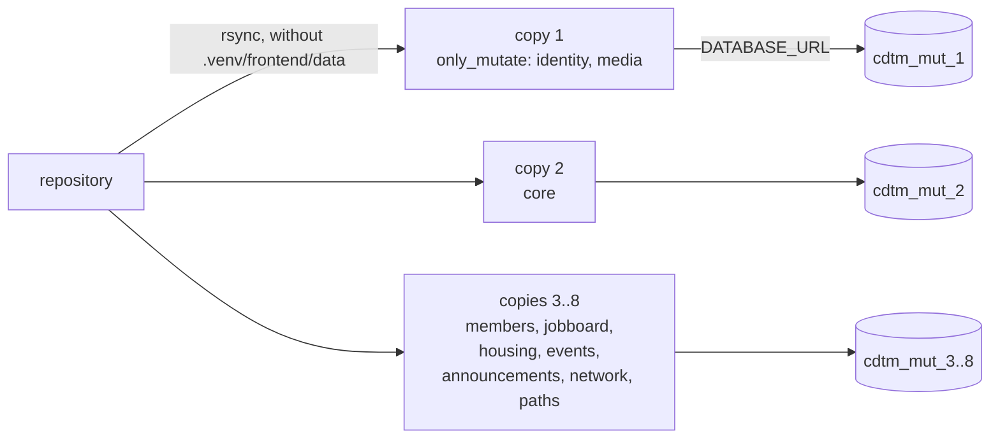
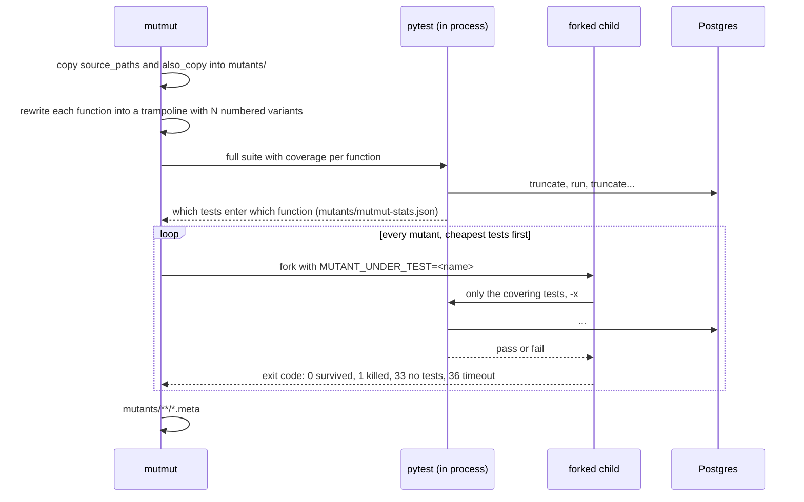

# Mutation testing

Line coverage says a test ran a line. Mutation testing says whether a test would notice if
that line were wrong. [mutmut](https://mutmut.readthedocs.io/) rewrites each function of the
backend into small variants (a `<` becomes `<=`, a `return x` becomes `return None`, a string
argument is swapped) and runs the tests that reach that function against every variant. A
variant the suite still passes with is a *survivor*: either the mutation is equivalent and
changes nothing observable, or nothing asserts on that behaviour.

This document is the record of the first whole-backend campaign (24 August 2026), how to run
one again, and the quirks of the tool that cost time the first time.

## 1. What the first campaign found

The whole backend was mutated: 7,798 mutants across 160 files, eight slices of the code run in
parallel, each in its own repository copy against its own Postgres database.

| | Before | After |
| --- | --- | --- |
| Mutants | 7,798 | 7,798 |
| Killed | 4,265 (54.7%) | 7,227 (92.7%) |
| Survived | 2,396 | 525 |
| No test reaches the function | 1,129 | 38 |

Every survivor was read and classified (HIGH: authorization, visibility, redaction, limits,
data loss; MEDIUM: functional logic and validation; LOW: cosmetic; EQUIVALENT). 49 were HIGH.
None of them was a production defect: each was a behaviour the code got right and no test
pinned down. The fix was 389 tests in 47 files, all named `*_gaps*` under `tests/`, so they
sit next to the originals without editing them. No production line changed.

Behaviour that had no test at all before the campaign, and has one now:

- Every directory filter narrowing the directory (44 cases over one seeded directory), the
  `hidden` Entry staying out of the search text without emptying the rest of the index, and
  `needs_review` being refused for non-admins.
- Every `JobFilters` field matched positively (company, work arrangement, remote only, salary
  floor, country, CDTM startup, posted within, sort), `LIKE` escaping, paging bounds, and the
  poster's own confidential salary staying visible in listings and slug lookups, not only on
  `GET /jobs/{id}`.
- Seeker profile update and delete by the owner and by an admin.
- A housing Ask answer holding only listings that are on the board, every clause of a
  question being applied (a nine-decoy matrix), and the per-member rate limit; event delete
  and edit refused for anyone but the organiser, and the RSVP tallies per event and status.
- The Ask translators for members, jobs and housing through a fake `StructuredCompleter` at
  the port and `httpx.MockTransport` at the provider boundary. `LLM_PROVIDER=none` is fixed
  for the whole suite, so every provider branch was dark before.
- `SqlQuestionMeter` enforcing the durable per-member ceiling and not silently falling back to
  the in-process limiter; the error envelope redacting every message with status 500 or above,
  a 503 `RepositoryError` included.
- JWT verification against a real JWKS document served over loopback: a token signed by an
  unpublished key, an unknown `kid`, another audience, an expired token, and no JWKS or
  secret configured are all refused; the signing key is cached across tokens.
- Announcement read receipts, intro requests (only the requester withdraws, only the target
  responds) and saved members through the real database.

### What stays alive on purpose

About five hundred mutants survive, and a test for them would cost more than it protects:

- Wording: the text passed to `NotFoundError`, `ForbiddenError` and `ValidationError`, log
  messages, prompt sentences. Pinning strings makes the suite brittle without protecting
  behaviour.
- `run_db` telemetry labels and its `session=` rollback argument, observable only with fault
  injection. Where a real unique violation can reach the rollback (binding an Account to a
  Member, `upsert_classes`, `set_email`) it is tested through the database.
- Provably equivalent constructs: `datetime.now(None)`, header-name case (httpx lowercases
  them), `.limit(None)` on an already bounded query, selecting a column that is never read.
- The same mutation in both LLM adapters, dropping the injected transport: a real
  `httpx.AsyncClient` aborts inside a forked worker on macOS, so mutmut reports it as
  suspicious rather than killed.

### Things the survivors pointed at

These are not test gaps; they are code the campaign showed to be unreachable or unused.

- `AuthService.get_account`, `SqlAccountRepository.get_by_auth_user_id` and `get_by_id` have
  no callers. They are 36 of the 38 remaining no-test mutants. Delete them and the two
  `ports.py` entries.
- `EntryService`'s admin override (edit another Member's Entry by id) cannot be reached over
  HTTP: `backend/members/api/me.py` never passes a `member_id`. Expose it or remove it.
- `NetworkRepository.get_saved` is never called by `NetworkService`;
  `SqlAnnouncementRepository.get`'s `include_hidden` default is dead.
- The housing and events delete repositories return whether a row went, and both services
  discard the value, so deleting an already deleted id looks like a successful delete.

## 2. Running it

`pyproject.toml`'s `[tool.mutmut]` mutates only the security-critical files (authorization,
visibility, redaction, token verification, limits). That run needs nothing special:

```bash
LLM_PROVIDER=none uv run mutmut run --max-children 1
uv run mutmut results               # survivors
uv run mutmut show <mutant_name>    # the diff of one mutant
uv run mutmut browse                # interactive
```

`--max-children 1` is not optional. `tests/integration/conftest.py` truncates every table
before each test, so two pytest children on one database fail each other's tests, and mutmut
reads a failing test as a kill. Left at the default, every mutant looks killed and the score
is a lie.

### The whole backend

Whole-backend runs take hours serially, and parallelism has to come from separate databases,
not from `--max-children`. The campaign split the backend into eight slices by domain and line
count, one repository copy and one database each:



For each copy:

```bash
createdb cdtm_mut_1
# in the copy's pyproject.toml, under [tool.mutmut]:
#   only_mutate = [ ...the slice's files... ]
#   pytest_add_cli_args = ["--ignore=tests/integration/test_migrations.py"]
cd /path/to/copy
DATABASE_URL=postgresql://localhost:5432/cdtm_mut_1 LLM_PROVIDER=none \
  /path/to/repo/.venv/bin/python -m mutmut run --max-children 1
```

`test_migrations.py` is excluded because it creates a hardcoded scratch database
(`cdtm_community_migration_check`) that parallel suites race on; it enters no backend function,
so excluding it changes no score. Two or three copies at a time is fine on a ten-core laptop.
Eight is not: a test failing under load is indistinguishable from a kill, and the campaign's
final numbers had to be re-measured with three at a time.

What a mutmut run does, per slice:



The per-file results are in `mutants/**/*.meta` (one JSON per source file, exit code per
mutant). `mutmut results` prints the survivors; `mutmut show <name>` prints one diff.

### After adding tests

mutmut caches the test-to-function map in `mutants/mutmut-stats.json` and does not re-check a
mutant it has already judged. After adding a test, delete the cache and rerun the mutants you
are aiming at by name, still with `--max-children 1`:

```bash
rm mutants/mutmut-stats.json
LLM_PROVIDER=none uv run mutmut run --max-children 1 <mutant_name> <mutant_name>
```

Adding an assertion to an existing test without deleting the cache does nothing visible.

## 3. Blind spots

mutmut 3.7 never rewrites a decorated function or a decorated class. In this codebase that
means zero mutants for:

- route handlers (`@router.get` and friends), so the API layer's own logic (query parsing,
  status codes chosen inside a handler) is measured only through the services it calls;
- `@property`, pydantic `@field_validator` and `@model_validator`;
- every `@dataclass` body: `core/llm/rate_limit.py`'s `TokenBucketLimiter` produced no
  mutants at all;
- `Protocol` ports and SQLAlchemy declarative models.

67 of the backend's files produce no mutants for these reasons. A file with no mutants is not
a safe file.

A crashing child is a kill. mutmut records the child's exit code, and an exception inside the
child (pytest exit code 4, a usage error) exits with 1, which is "killed". The campaign found
one way to trigger that on every mutant of a function: a parametrized test whose id contains
a non-ASCII character. pytest escapes the id (`München` becomes `M\xfcnchen`) and escapes it
again when it collects a second time in the same process, which every forked child does, so
the ids mutmut passes back are "not found" and the whole file scores 100% without a single
test running. `ask_translator_rules.py` scored 441 of 441 that way until
`tests/unit/test_ask_golden.py` got ASCII ids. Keep test ids ASCII, and treat a file at
exactly 100% with suspicion before celebrating it.

Two smaller ones. Coverage-based test selection misses code that runs at import or fixture
time (`settings/_cache.py`, `settings/_env.py`, parts of `create_app`): a function entered
before any test starts looks untested, and needs a test that calls it directly. And a suite
that is red for any reason stops mutmut before it starts ("failed to collect stats"), so a
known-failing test has to be deselected with `pytest_add_cli_args` for the duration.

## 4. Reading the score

Killed divided by all mutants, per file, is the number to watch, and the per-function detail
is what to act on. A low score on a file of error messages is fine; a single survivor in
`visibility.py` or `jwt_verifier.py` is not. When a survivor is equivalent, say so in the
test file's docstring next to the test that covers its neighbours, so the next campaign does
not read it again.

Exit codes in `.meta` files: `0` survived, `1` killed, `33` no tests reach the function, `36`
timeout, `37` killed by type check. Tally them with a few lines of Python over
`mutants/**/*.meta` rather than by hand.
